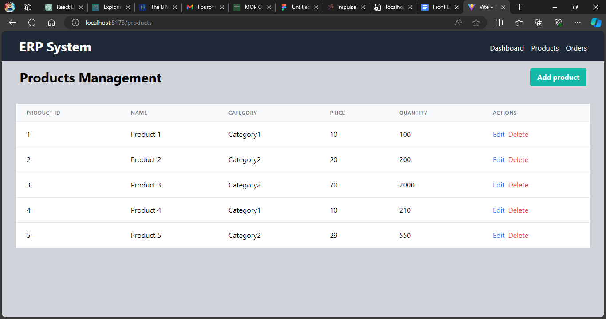
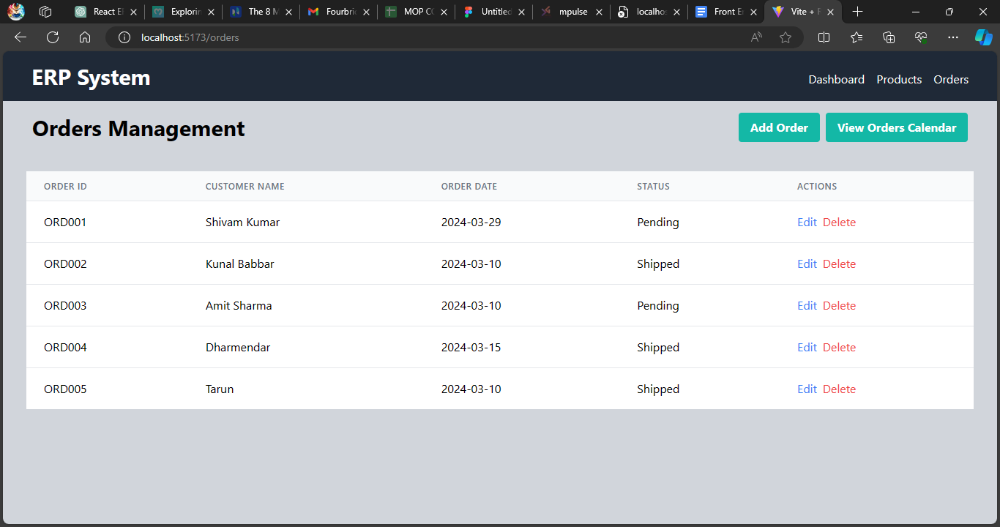
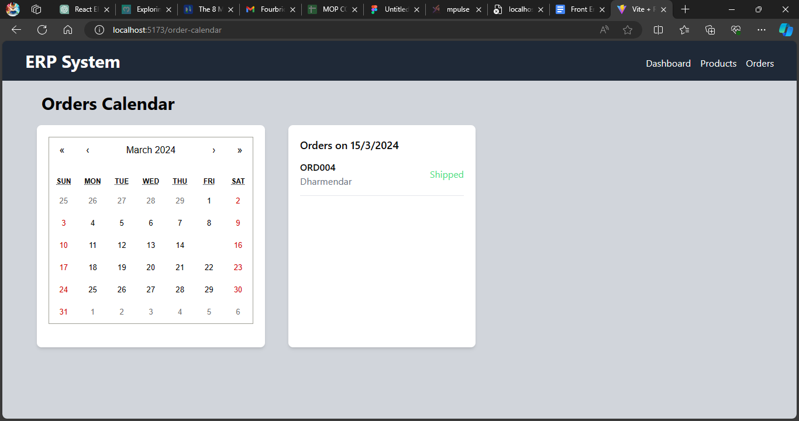

# ERP System

## Project Overview

The goal of this project is to create a simplified interface for an ERP (Enterprise Resource Planning) system, designed to manage basic business operations efficiently. The system consists of the following pages:

- **Dashboard**: Provides an overview of the system's features.
- **Products Management**: Allows for the management of product listings.
- **Orders Management**: Facilitates viewing and handling orders.
- **Orders Calendar View**: A calendar interface displaying orders based on their expected delivery dates.

## Objectives

- Developed a user-friendly interface for managing key aspects of a business.
- Utilized React for building modular components and managing application state.
- Implemented navigation between different sections of the ERP system using React Router.
- Created a responsive design suitable for both desktop and mobile devices.

##  Project Details

### Dashboard:

- Displays a summary of key metrics or features (e.g., total number of products, orders).
- Included buttons for quick navigation to the Products and Orders management pages on the Navbar.

### Products Management:

- Presents a list of products with details such as name, category, price, and stock quantity, using mock data.
- Enabled functionalities to add, edit, and delete products.

### Orders Management:

- Shows a list of orders, including details like order ID, customer name, order date, and status, using mock data.
- Allow viewing of order details, updating the order status, and deletion of orders.

### Orders Calendar View (Optional):

- Implemented a calendar view that displays orders on their expected delivery dates.
- Provide the ability to click on a date to view all orders due for delivery that day.

## Technology Stack

This project is built using the following technologies and frameworks:

- **React**: Used for building modular components and managing application state.
- **React Router**: Implemented for navigation between different sections of the ERP system.
- **React Calendar**: Utilized to implement the calendar interface for displaying orders based on their expected delivery dates.
- **React Chart.js 2**: Employed for visualizing data in charts, such as revenue trends and inventory aging.
- **React Hook Form**: Used for form management, including adding, editing, and deleting products in the Products Management page and managing orders in the Orders Management page.
- **Tailwind CSS**: Utilized for styling the user interface and ensuring responsiveness across different devices.

## Installation

To install and run the project locally, follow these steps:

1. Clone this repository.
2. Navigate to the project directory.
3. Run `npm install` to install dependencies.
4. Run `npm run dev` to start the development server.

## Dependencies

- React
- React Router DOM
- React Hook Form
- Chart.js
- React Chartjs 2
- React Calendar

## Screenshots

